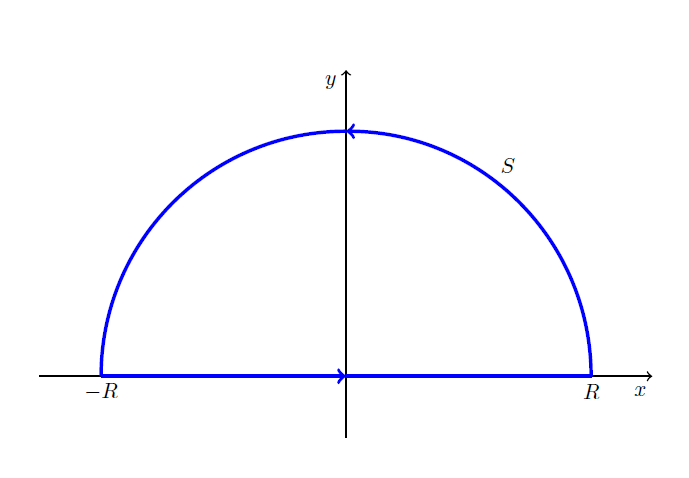

# Complex Function

崔宰珪；宁静楼 313；jaycjk@tongji.edu.cn；微信 jaycjk

微信群

| 上课内容                                                     |
| ------------------------------------------------------------ |
| 1. 复数，函数     1.1. 复数，复平面     1.2. 三角形式，乘方，方根 |
| 1.3. 导数，解析函数     1.4. Cauchy-Riemann 方程，Laplace 方程 |
| 1.5. 指数函数     1.6. 三角函数和双曲函数                    |
| 1.7. 对数，幂函数                                            |
| 2. 复积分     2.1. 复平面上的线积分     2.2. Cauchy 积分定理     注意！由于 10 月 7 日为十一假期，该课程与 10 月 9 日对调。 |
| 2.3. Cauchy 积分公式     2.4. 解析函数的导数                 |
| 3. Taylor 级数，Laurent 级数     3.1. 序列，级数     3.2. 幂级数 |
| 3.2. 幂级数（继续）     3.3. 幂级数的和函数                  |
| 3.4. Taylor 级数，Macluarin 级数     3.5. Laurent 级数       |
| 3.5. Laurent 级数（继续）     3.6. 奇点，零点，无穷远点      |
| 3.7. 留数积分法     3.8. 实积分中的应用                      |
| 3.8. 实积分中的应用（继续）     （时间允许的话）习题选讲     |
| 4. 积分变换     4.1. Fourier 变换：Fourier 变换              |
| Fourier 逆变换，Dirac delta                                  |
| 离散革命 (The discrete revolution)                           |
| 离散 Fourier 变换，快速 Fourier 变换                         |
| 4.2. Laplace 变换                                            |
| Laplace 变换（继续），Laplace 逆变换（浅谈）                 |
| 4.3. 微分方程中的应用：常微分方程中的 Laplace 变换           |
| 常微分方程中的 Laplace 变换 （继续）                         |
| 偏微分方程中的 Fourier 变换                                  |
| 时间遇到了频率（Time meets frequency）：浅谈信号时频分析     |
| 总复习及答疑                                                 |
| 总复习及答疑                                                 |
| 期末考查                                                     |

## Complex Numbers

### Conjugate Complex Numbers

$\text{For }z = x + i y,\ \text{the conjugate } \overline{z} = x - i y$.
$$
Re \ z = 1/2(z + \overline{z})\\
Im \ z = 1/2(z - \overline{z})\\
|z| = \sqrt{z \cdot \overline{z}}\\
\overline{z_1 + z_2} = \overline{z_1} + \overline{z_2}\\
\overline{z_1 z_2} = \overline{z_1} \overline{z_2}\\
\overline{(\frac{z_1}{z_2})}=\frac{\overline{z_1}}{\overline{z_2}}
$$

### Argument of Complex Numbers

$\theta = \arg z = \arctan {\frac{y}{x}}$

Principle value of argument（辐角主值）

$\theta = \text{Arg } z = \arctan \frac{y}{x}$
$$
-\pi < \text{Arg} \leq \pi\\
\arg z = \text{Arg } z + 2n\pi
$$

### Triangle Inequation

$|z_1| + |z_2| \geq |z_1 + z_2|$

By induction,

$$
\sum_{i=1}^n |z_n| \geq |\sum_{i=1}^n z_n|
$$

### De Moivre's Formula

$$
(\cos \theta + i \sin \theta)^n=\cos n \theta + i \sin n \theta
$$

### Root

$$
\omega ^n = z = r e ^{i \theta}\\
\omega = \sqrt[n]{r} e ^{i \varphi}\\
\text{where } n \varphi = \theta +2k\pi,\ k = 0,1,\cdots,n-1\\
\text{suppose } w_1= \sqrt[n]{r} e ^{\frac{\theta}{n}} ,\ \omega = e ^{\frac{2\pi}{n}}
$$

Then the nth roots can be written as $w_1 \omega ^k$, where $k = 0,1,\cdots,n-1$, where $\omega$ is one of the nth roots of unity.

$$
\sqrt[n]{1}=e ^{i \cdot \frac{2\pi}{n}}
$$

所有解构成一个 n 边形。

## Complex function

$w = f(z)$

where domain and codomain / range are both complex set.

***z*** is called a **complex variable**.
$$
w=u+iv \\ z=x+iy \\ \text{then } w=u(x,y)+iv(x,y)
$$

Thus we transform complex function to real function.

### Limit of Complex Function

$$
\lim_{z \rightarrow z_0}f(z)=l \\
\forall \epsilon > 0,\exist \delta > 0,\text{ when } |z-z_0|<\delta, |f(z)-l| < \epsilon
$$

**Direction is irrelevant.**

### Continuity

1. $\exist f(z_0)$
2. $\lim_{z\rightarrow z_o}f(z)=f(z_0)$

### Derivative

$$
f'(z_0)=\lim_{z\rightarrow z_0} \frac{f(z)-f(z_0)}{z-z_0}
$$

Similarly, **direction is irrelevant.**

二元函数的极限存在，则必然和趋向的方向无关。

***Example***: $f(z)=\overline{z}$
$$
\lim_{z\rightarrow z_0} \frac{f(z)-f(z_0)}{z-z_0}=\lim_{z\rightarrow z_0} \frac{\overline{z}-\overline{z_0}}{z-z_0} = \lim_{\Delta z \rightarrow 0} \frac{\overline{\Delta z}}{\Delta z} = \lim_{(\Delta x,\Delta y) \rightarrow (0,0)} \frac{\Delta x - i \Delta y}{\Delta x + i \Delta y} \text{ isn't existing.}
$$

### Analytic Function

- Analyticity in Domain $\forall z \in D, \exists f, \exists f'$
- Analyticity at Point $\forall z \in U(z_0, \delta), \exists f, \exists f'.$

Entire Function: analytic in whole complex plane.

一般来说，在某一个点上可导是没有实际意义的。

### Cauchy-Riemann Equation

Complex Function $w = f(z) = u(x, y) + i v(x, y)$ is analytic,
if and only if it satisfies:
$$
\frac{\partial u}{\partial x} = \frac{\partial v}{\partial y} \\
\frac{\partial u}{\partial y} + \frac{\partial v}{\partial x} = 0
$$
A criterion to test if a function is analytic.

关于其必要性的证明：将复变函数的导数分别按照两种最简单的路径（平行于坐标轴）求极限，实部和虚部对应相等。

$f'(z)$ 存在。
$$
\begin{equation}
\begin{array}{rlc}
f'(z) &= \lim_{\Delta x \rightarrow 0, \Delta y \rightarrow 0} \frac{u(x + \Delta x, y + \Delta y) - u(x, y) + i[v(x + \Delta x, y + \Delta y) - v(x, y)]}{\Delta x + i \Delta y}\\
& = \lim_{\Delta x \rightarrow 0} \left\{ \lim_{\Delta y \rightarrow 0} \frac{u(x + \Delta x, y + \Delta y) - u(x, y) + i[v(x + \Delta x, y + \Delta y) - v(x, y)]}{\Delta x + i \Delta y} \right\} \\
&= \lim_{\Delta x \rightarrow 0} \frac{u(x + \Delta x, y) - u(x, y) + i[v(x + \Delta x, x) - v(x, y)]}{\Delta x} \\
&= u_x + i v_x
\end{array}
\end{equation}
$$
交换求极限的顺序（？）可以得到：
$$
f'(z) = v_y - i u_y
$$
因此：
$$
\left\{
\begin{array}{rlc}
&u_x = v_y \\
&v_x = -u_y
\end{array}
\right.
$$
关于其充分性的证明：？differentiability of a multivatiate function（逆着证明一遍）

二元函数可微：
$$
\Delta u = u_x \Delta x + u_y \Delta y + \omicron(\left| \Delta z \right|) \\
\Delta v = v_x \Delta x + v_y \Delta y + \omicron(\left| \Delta z \right|)
$$
根据柯西黎曼方程，设 $a = u_x = v_y, b = v_x = - u_y$
$$
f(z + \Delta z) - f(z) = (a + i b)\Delta z + \omicron(\Delta z)
$$
从而
$$
f'(z) = \lim_{\Delta z \rightarrow 0} \frac{f(z + \Delta z) - f(z)}{\Delta z} = a + i b
$$
证明完毕。

Cauchy-Riemann Equation in Polar System
$$
\frac{\partial u}{\partial r} = \frac{1}{r} \frac{\partial v}{\partial \theta} \\
  \frac{\partial v}{\partial r} = - \frac{1}{r} \frac{\partial u}{\partial \theta}
$$

### Laplace's Equation

$$
\Delta u = u_{xx} + u_{yy} = 0 \\
\Delta v = v_{xx} + v_{yy} = 0
$$

证明就把 Cauchy-Riemann 方程分别对 x，y 求偏导。过程需要用到：$u_{xy} = u_{yx}$.？

下面证明极坐标下的 Laplace's Equation:

Cauchy-Riemann Equation in Polar System:

$$
\begin{bmatrix} u_r \\ v_r \end{bmatrix} = \frac{1}{r} \begin{bmatrix} 0&1 \\ -1&0 \end{bmatrix}  \begin{bmatrix} u_{\theta} \\ v_{\theta} \end{bmatrix}
$$

Take the derivation of r:

$$
\begin{bmatrix} u_{rr} \\ v_{rr} \end{bmatrix} = \frac{\partial}{\partial r} (\frac{1}{r} \begin{bmatrix} 0&1 \\ -1&0 \end{bmatrix}  \begin{bmatrix} u_{\theta} \\ v_{\theta} \end{bmatrix}) = - \frac{1}{r} \begin{bmatrix} u_r \\ v_r \end{bmatrix} + \frac{1}{r} \begin{bmatrix} 0&1 \\ -1&0 \end{bmatrix}  \begin{bmatrix} u_{\theta r} \\ v_{\theta r} \end{bmatrix}
$$

Take the derivation of $\theta$:
$$
\begin{bmatrix} u_{r \theta} \\ v_{r \theta} \end{bmatrix} = \frac{1}{r} \begin{bmatrix} 0&1 \\ -1&0 \end{bmatrix} \begin{bmatrix} u_{\theta \theta} \\ v_{\theta \theta} \end{bmatrix}
$$

$$
u_{r \theta} = u_{\theta r} \\
v_{r \theta} = v_{\theta r}
$$

So:

$$
\begin{bmatrix} u_{rr} \\ v_{rr} \end{bmatrix} = -\frac{1}{r} \begin{bmatrix} u_r \\ v_r \end{bmatrix} + \frac{1}{r^2} \begin{bmatrix} -1&0 \\ 0&-1 \end{bmatrix} \begin{bmatrix} u_{\theta \theta} \\ v_{\theta \theta} \end{bmatrix} = -\frac{1}{r} \begin{bmatrix} u_r \\ v_r \end{bmatrix} - \frac{1}{r^2} \begin{bmatrix} u_{\theta \theta} \\ v_{\theta \theta} \end{bmatrix}
$$

### Harmonic Function

Functions that satisfy Laplace' Equation and have continuous second derivation.

A pair of function that satisfy Cauchy-Riemann Equation is called **Harmonic Conjugate Funcion**, they are real part and imaginary part of an analytic function $w = f(z)$.

如果已知一个函数满足拉普拉斯方程，那么可以找到它的共轭调和函数，其中含有一个任意的常数。例如对于函数 $u = x^2 - y^2 - y$.

$$
v_x = -u_y = 2y + 1
$$

$$
v_y = u_x = 2x
$$

$$
v(x,y) = 2xy + x + h(y) \\
v_y = 2x + \frac{\partial h(y)}{\partial y}
$$
$$
\frac{\partial h(y)}{\partial y} = 0 \\
h(y) = c \\
v(x,y) = 2xy + x + c \\
w = u + iv = x^2 - y^2 - y + i(2xy + x + c) = z^2 + iz + ic
$$

### Elementary Functions

#### Expotential Function

Definition: $e^z = e^x (\cos y + i \sin y)$.

Properties:

- Degeneration to $e^x$ when $y=0$.
- Entire Function
- $(e^z)' = e^z$
- $e^{z_1 + z_2} = e^{z_1} \cdot e^{z_2}$
- $|e^z| = e^x, \mathrm{Arg} e^z = y + 2 \pi n (n \in Z)$
- $e^z = \sum_{i=0}^{\infty} \frac{z^i}{z!}$
- Periodicity: $e^{z + i2 \pi} = e^z$

Thus we can gain the entire information of an expotenial function by its value in $\{z = x + i y ,\ - 2 \pi < y < 2 \pi\}$, which is called **fundamental region**.

Thereom from Periodicity

Suppose two complex number whose imaginary $|\Im z_1 - \Im z_2| < 2 \pi$, then $e^{z_1} \neq e^{z_2}$.

#### Trigonometric & Hyperbolic function

According to the [definition of expotential function](#Expotential Function):
$$
\cos z = \frac{e^{iz} + e^{-iz}}{2} = \cosh iz \\
\sin z = \frac{e^{iz} - e^{-iz}}{i2} = -i \sinh iz
$$
Properties
$$
\cos z = \cos x \cosh y - i \sin x \sinh y \\
\sin z = \sin x \cosh y + i \cos x \sinh y \\
|\cos z|^2 = \cos^2 x + \sinh^2 y \\
|\sin z|^2 = \sin^2 x + \sinh^2 y
$$
$\sin x, \cos x$ 的零点仍然只存在于实轴上。它们变成了无界函数，值域为全体复数 $C$.

Expand the definition in real ret:
$$
\cosh z = \frac{e^{z} + e^{z}}{2} \\
\sinh z = \frac{e^{z} - e^{z}}{2}
$$
Properties
$$
\cosh iz = \cos z \\
\sinh iz = i \sin z \\
\cos iz = \cosh z \\
\sin iz = \sinh z
$$

#### Logarithm

Definition by the inverse of exponential:
$$
w = \exp{z} \Rightarrow w = \mathrm{Ln} z \\
\mathrm{Ln} z = \ln |z| + i \mathrm{Arg} z = \ln|z| + \arg z + i 2 \pi n (n \in \Z)
$$
Principle Value:
$$
\ln z = \ln |z| + i \text{arg} z
$$
每一个 n 对应一个分支，主值（$n=0$）称为主分支。 每一个分支构成一个单叶区域（该区域上任意两个不同的复数经过函数映射以后的值不相等），在沿着原点和负半轴割破的复平面内解析。

对于通值函数仍然满足实变函数的性质：
$$
\mathrm{Ln} (z_1 z_2) = \mathrm{Ln} z_1 + \mathrm{Ln} z_2 \\
\mathrm{Ln} \frac{z_1}{z_2} = \mathrm{Ln} z_1 - \mathrm{Ln} z_2
$$
The Analycity of Logarithm
$$
\begin{align}
\mathrm{Ln} z &= \ln \sqrt{x^2 + y^2} + i \arctan \frac{y}{x} + i 2 \pi n & (n \in Z) \\
u_x &= \frac{x}{\sqrt{x^2 + y^2}} =v_y \\
u_y &= \frac{y}{\sqrt{x^2 + y^2}} = -v_x
\end{align}
$$
The logarithm satisfies the Cauchy-Riemann Equation when $r \neq 0$ and $x \neq 0$.?
$$
(\mathrm{Ln} z)' = u_x + i v_x = \frac{x - i y}{\sqrt{x^2 + y^2}} = \frac{1}{z}
$$
The Analycity of Principle Logarithm?

Branch cut: 0 + negative real axis.

#### General Powers

$$
z^c = e^{c \ln z}
$$

Principle value:
$$
z^c = e^{c \text{Ln} z}
$$

一般来说，对于底数为实数的幂函数，习惯上只考虑它的主值。这样就可以统一之前关于指数函数的唯一定义。

## Complex Integration

### Complex Line Integrals

$$
\begin{aligned}
S &= \int_C f(z) \text{ d}z \\
C: z(t) &= x(t) + i y(t) & t \in [a, b]
\end{aligned}
$$

Assume ***C*** to be a smooth curve:
$$
\dot{z} (t) = \frac{\text{d}z}{\text{d}t} = \dot{x}(t) + i \dot{y}(t)
$$
==Continuous and nonzero derivative== at each point.

定义和实变函数的定积分类似，只是把实数轴换成了连续光滑的平面曲线。
$$
\begin{aligned}
\{t_i\} &= \{t_0 = a, t_1, \cdots, t_{n-1}, t_n = b\} \\
\{z_i\} &= \{z(t_i)\} \\
\{\zeta_i\} &= \{z(t)\} & \forall t \in [t_{i-1}, t_i] \\
\int_C f(z) \mathrm{d} z &= \lim_{n \rightarrow \infty, \Delta z_m \rightarrow 0} \sum_{i=1}^{n} f(\zeta_i) \Delta z_m & \Delta z_m = z(t_m) - z(t_{m-1})
\end{aligned}
$$

Properties implied by definition:

- Linearity $\int_C [k_1 f_1(x) + k_2 f_2(x)] \text{ d}x = k_1 \int_C f_1(x) \text{ d}x + k_2 \int_C f_2(x) \text{ d}x$
- Sense reversal $\int_C f(z) \text{ d}z = - \int_{C^-} f(z) \text{ d}z$
- Partition of Path $\int_{C_1 \cup C_2} f(z) \mathrm{d} z = \int_{C_1} f(z) \mathrm{d} z + \int_{C_2} f(z) \mathrm{d}z$

复数线积分的存在性：

- 被积分函数是连续函数
- 积分路径是光滑曲线

证明方法：将复数积分转化为实数积分

单连通区域：其中的任意一条简单闭曲线围成的区域中的所有点都属于该区域中。

#### Evaluation Method

- Indefinite Integration of Analytic Functions

$f(z)$ is analytic in simply connected domain $D$, there exists an ==indefinite integral== of $f(z)$ in $D$:
$$
\int_{z_0}^{z_1} f(z) \text{ d}z = F(z_1) - F(z_0)
$$
where $F'(z) = f(z)$.

- Use a Representation of a Path

$$
\int_C f(z) \text{ d}z = \int_a^b f(z(t)) \dot{z}(t) \text{ d}t
$$

where $z = z(t), \ t \in [a, b] \ f(z)$ is continuous.

求解 $\int_C \frac{\mathrm{d}z}{z}$，其中 $C$ 是单位逆时针圆周。
$$
\begin{align}
\oint_C \frac{\mathrm{d}z}{z} &= \int_0^{2 \pi} \frac{\dot{z} \mathrm{d}\theta}{z} \\
&= i \int_0^{2 \pi} \mathrm{d} \theta \\
&= i 2 \pi
\end{align}
$$
$$
\begin{equation}
\oint_C (z - z_0)^m \mathrm{d}z = \left\{
\begin{array}{rlc}
i 2 \pi & (m = -1) \\
0 & (m \neq -1 \text{ and } m \in \Z)
\end{array}
\right.
\end{equation}
$$

#### ML Inequation

$$
\left| \int_C f(z) \text{ d}z \right| \leq ML \\
\forall z \text{ on }C,M \geq |f(z)| \\
L = \int_C |z| \text{ d}z \text{ is the length of curve }C
$$

### Cauchy's Integral  Thereom

本定理给出了关于[第一种求线积分方法](#evaluation-method)的证明。

#### Simply Closed Path

A close Path that does not intersect or touch itself.

$z(t) = z$ 的根的数量小于等于 1.

#### Simply Connected Domain

$\forall \text{ simple closed path } C \in D, \forall \text{ points enclosed by } C \in D$.

#### p-fold connected

由 p 个没有交集的单闭合集合（可以是曲线、线段甚至点）作为边界的有界领域。

#### Content of Cauchy's Integral Thereom

CONDITION: (Sufficient rather than Necessary)

- $f(z)$ is analytic in ==simply connected domain== D
- C is a simply closed path in D

CONCLUSION:
$$
\oint_C f(z) \text{ d}z = 0
$$
PROOF: (Cauchy's proof assuming that $f'(z)$ is continuous.)
$$
\begin{aligned}
\oint_C f(z) \text{ d}z &= \oint_C (u + i v) (\text{d}x + i  \text{d}y) \\
&= \oint_C (u \text{d}x - v \text{d}y) + i \oint_C (v \text{d}x + u \text{d} y) \\
&= \iint_R(- \frac{\partial v}{\partial x} - \frac{\partial u}{\partial y})\text{d}x \text{d}y + i \iint_R (\frac{\partial u}{\partial x} - \frac{\partial v}{\partial y}) \text{d}x \text{d}y \text{ (by Green's Thereom)} \\
&=0 \text{ (by Cauchy-Riemann Equation)}
\end{aligned}
$$
?Goursat's proof without assumption that $f'(z)$ is continuous is far more complicated.

INFERENCE:

- CONDITION: $f(z)$ is analytic in simply connected domain D
- CONCLUSION: the integral of $f(z)$ is independent of path in D

$$
\oint _C (z - z_0)^m \text{d}z = 0 \ (m \neq -1) \\
\oint _C \frac{\text{d}z}{z - z_0} = i 2 \pi
$$

计算的结果是通过按照参数方程计算单位圆得到的，通过路径变形原理可以得到==对任意包含 $z_0$ 在内的路径==环路积分结果都相等。

#### Cauchy's Integral Thereom for double connected domain

双连通区域由外边界和内边界构成。

转化成单连通区域
$$
\oint_{C_1} f(z) \text{d}z + \int_{\widetilde{C}} f(z)\text{d}z + \oint_{C_2^{-1}} f(z)\text{d}z + \int_{\widetilde{C}^-} f(z) \text{d}z = 0 \\
\oint_{C_1} f(z) \text{d}z = \oint_{C_2} f(z) \text{d}z
$$

### Cauchy's Integral Formula

CONDITION:

- $f(z)$ is analytic in simply connected domain $D$
- $z_0 \in D$
- Simply close path $C$ encloses $z_0$

CONCLUSION:
$$
\oint_C \frac{f(z)}{z - z_0} \text{d}z = i 2 \pi f(z_0)
$$
where the integration is taken ==counterclockwise==.

PROOF:
$$
\begin{align}
\oint_C \frac{f(z)}{z - z_0} \text{d}z &= f(z_0) \oint_C \frac{\text{d}z}{z - z_0} + \oint_C \frac{f(z) - f(z_0)}{z - z_0} \text{d}z \\
&= i 2 \pi f(z_0) + \oint_K \frac{f(z) - f(z_0)}{z - z_0} \text{d}z
\end{align}
$$
where $K$ is a circle of radius $\rho$ and center $z_0$.

利用了[之前结论](#content_of_cauchy's_integral_thereom)和解析函数线积分路径无关的性质。
$$
\forall \varepsilon > 0, \exists \delta > 0,\forall z \in \{z \in C: \left|z - z_0\right| < \delta\}, \left|f(z) - f(z_0)\right| < \varepsilon \\
$$

choosing $\rho < \delta$:

$$
\left|\frac{f(z) - f(z_0)}{z - z_0}\right| < \frac{\varepsilon}{\rho}
$$

According to [ML-Inequation](#ML_Inequation):
$$
\begin{align}
\oint_K \frac{f(z) - f(z_0)}{z - z_0} \text{d}z &< \frac{\varepsilon}{\rho} \cdot 2 \pi \rho = 2 \pi \varepsilon \\
\oint_K \frac{f(z) - f(z_0)}{z - z_0} \text{d}z &= 0 \\
\oint_C \frac{f(z)}{z - z_0} \text{d}z &= i 2 \pi f(z_0)
\end{align}
$$
证明完毕。

这个定理指出了一个与静电场理论十分相似的性质：

如果两个函数均在有界区域 $D$ 内解析，在 $\overline{D}$ 上连续且 $\forall z \in \partial D, f(z) = g(z)$，则：
$$
\forall z \in D, f(z) = g(z)
$$

PROOF:
$$
\forall z \in D, f(z) = \frac{1}{i 2 \pi} \oint_{\partial D} \frac{f(\zeta)}{\zeta - z} \mathrm{d} \zeta = \frac{1}{i 2 \pi} \oint_{\partial D} \frac{g(\zeta)}{\zeta - z} \mathrm{d} \zeta = g(z)
$$

For ==Multiply Connected domains==, we use similar method as proof in [Cauchy's Integral Thereom](#Cauchy's_Integral_Thereom_for_double_connected_domain).
$$
\oint_{C_{out}} \frac{f(z)}{z - z_0} \text{d}z - \oint_{C_{in}} \frac{f(z)}{z - z_0} \text{d}z = i 2 \pi f(z_0)
$$

### Derivatives of Analytic Functions

#### Relation between Derivatives and Contour Integral

Cauchy Integration Formula proves that ==analytic functions have derivatives of all orders==, which establishes Taylor series representations.

CONDITION:

- $f(z)$ is analytic in domain $D$

CONCLUDION:

- $f(z)$ has derivatives of all orders.（这一点与实变函数很不同）

CONDITION:

- Simply closed path $C$ in domain $D$ encloses $z_0$.
- The interior of $C$ $\subset$ $D$

CONCLUSION:
$$
f^{(n)}(z_0) = \frac{n!}{i 2 \pi} \oint_C \frac{f(z)}{(z - z_0)^{n+1}} \text{d}z
$$
[Cauchy's Integral Formula](#Cauchy's_Integral_Formula) is a unique form of it.

一种记忆方法：
$$
\begin{aligned}
f^{(n)}(z_0) &= \frac{\partial^n}{\partial z_0^n} \left[\frac{1}{i 2 \pi} \oint_C \frac{f(z)}{z - z_0} \mathrm{d}z\right] \\
&= \frac{1}{i 2 \pi} \oint_C \frac{\partial^n}{\partial z_0^n} \frac{f(z)}{z - z_0} \mathrm{d}z \\
&= \frac{n!}{i 2 \pi} \oint_C \frac{f(z)}{(z - z_0)^{n+1}} \mathrm{d}z
\end{aligned}
$$

PROOF: (to 1st order)
$$
\begin{aligned}
\frac{f(z_0 + \Delta z_0) - f(z_0)}{\Delta z_0} &= \frac{1}{i 2 \pi \Delta z_0} [\oint_C \frac{f(z)}{z - z_0 - \Delta z_0} \text{d}z - \oint_C \frac{f(z)}{z - z_0} \text{d}z] \\
&= \frac{1}{i 2 \pi} \oint \frac{f(z)}{(z - z_0)(z - z_0 - \Delta z_0)} \text{d}z \\
&= \frac{1}{i 2 \pi} [\oint_C \frac{f(z)}{(z - z_0)^2} \text{d}z + \oint_C (\frac{f(z)}{(z - z_0)(z - z_0 - \Delta z_0)} \\
&- \frac{f(z)}{(z - z_0)^2})\text{d}z] \\
&= \frac{1}{i 2 \pi} [\oint_C \frac{f(z)}{(z - z_0)^2} \text{d}z + \oint_C \frac{f(z) \Delta z_0}{(z - z_0)^2 (z - z_0 - \Delta z_0)}\text{d}z]
\end{aligned}
$$
Continuouos $f(z)$ $\Rightarrow$ $\left|f(z)\right| < K$, where $K \in \R$.

随便找一些基准点
$$
2 \Delta z_0 \leq d \leq \left|z - z_0\right| \\
\frac{1}{\left|z-z_0\right|^2} \leq \frac{1}{d^2} \\
d \leq \left|z - z_0 - \Delta z_0 + \Delta z_0\right| \leq \left|z - z_0 - \Delta z_0\right| + \left|\Delta z_0\right| \\
\left|z - z_0 - \Delta z_0\right| \geq d - \Delta z_0 \geq \frac{d}{2} \\
\oint_C \frac{f(z) \Delta z_0}{(z - z_0)^2 (z - z_0 - \Delta z_0)} \text{d}z \leq \frac{2K}{d^3} \Delta z_0 L \\
\lim_{\Delta z_0 \rightarrow 0} \oint_C \frac{f(z) \Delta z_0}{(z - z_0)^2 (z - z_0 - \Delta z_0)} \text{d}z = 0
$$
其中利用了 [ML 不等式](#ML_Inequation)。最终：
$$
f'(z_0) = \lim_{\Delta z_0 \rightarrow 0} \frac{f(z_0 + \Delta z_0) - f(z_0)}{\Delta z_0} = \frac{1}{i 2 \pi} \oint_C \frac{f(z)}{(z - z_0)^2} \text{d}z
$$
以此类推可以得到任意阶导数的公式（数学归纳法？）。

#### Cauchy's Inequality

Choose $C$ as circle with center $z_0$ and radius $r$. Analytic Function $f(z)$ satisfies $f(z) < M, z \in C$. Then apply the ML Inequality to it:
$$
f^{(n)}(z_0) = \frac{n!}{i 2 \pi} \oint_C \frac{f(z)}{r^{n+1}} \text{d}z \\
\left|f^{(n)}(z_0)\right| \leq \frac{n!}{2 \pi} \left|\frac{M}{r^{n+1}}\right| (2 \pi r)= \frac{n! M}{r^{n}}
$$
That is Cauchy's Inequality:
$$
\left|f^{(n)}(z_0)\right| \leq \frac{n! M}{r^{n}}
$$

#### Liouville's Theorem

CONDITION:

- entire function $f(z)$
- $\forall z \in C, \left|f(z)\right| \leq M$. $f(z)$ is bounded.

CONCLUSION:
$$
f(z) = Const
$$
PROOF:

Apply Cauchy's Inequality to it:
$$
\left|f^{(1)}(z_0)\right| \leq \frac{M}{r}
$$
$\forall \varepsilon > 0, \exist r > \frac{M}{\varepsilon},\forall z_0 \in C, \left|f^{(1)}(z_0)\right| < \varepsilon$

Hence, $f'(z_0) = 0$.

According to $f'(z_0) = u_x + i v_x = u_y - i v_y$. (189) in [Cauchy-Riemann Equation](#Cauchy-Riemann Equation).
$$
u_x = v_x = u_y = v_y \Rightarrow u = Const, v = Const \Rightarrow f(z) = Const
$$

#### Morera's Theoreom

CONDITION:

- $f(z)$ is continuous in $D$
- $\forall C \text{ a closed path } \subset \text{ simple connected domain } D, \oint_C f(z) \mathrm{d}z = 0$

CONCLUSION:

$f(z)$ is analytic.

PROOF:

因为环路积分等于 0，所以从 $z_0$ 到 $z$ 的积分的值和路径无关。
$$
F(z) := \int_{z_0}^{z} f(z) \mathrm{d} z
$$
$F(z)$ is analytic.

According to [(343)](#Relation between Derivatives and Contour Integral), $f(z) = F'(z)$ is analytic.

## Taylor Series Laurent Series

### Convergence

定义和实数级数相同

复数序列收敛，当且仅当，实部序列和虚部序列均收敛。

复数级数收敛，当且仅当，实部级数和虚部级数均收敛。
$$
\lim_{n \rightarrow \infty} z_n = a + i b \iff \lim_{n \rightarrow \infty} x_n = a \text{ and } \lim_{n \rightarrow \infty} y_n = b
$$
PROOF:

Based on the geometric fact that:
$$
\mathrm{max} \{ \left|\mathrm{Re}z\right|, \left| \mathrm{Im}z \right| \} \leq \left|z\right| \leq \left|\mathrm{Re}z\right| + \left| \mathrm{Im}z \right|
$$
An obvioius conclusion:

if $s = \sum_{i = 1}^{\infty} z_i$ is convergence, $\lim_{n \rightarrow \infty} z_m = 0$

如果给定的无限级数收敛，则作为序列的极限为 0.（充分条件但不是必要条件）

Cauchy Principle

$s = \sum_{i = 1}^{\infty} z_i$ is convergence $\iff$ $\forall \varepsilon > 0, \exist N \in \N \text{ and } p \in \N,  \forall n > N, \left|\sum_{i = 1}^{p} z_{n+i}\right| < \varepsilon$

两种收敛：

- 绝对收敛：绝对值级数收敛。
- 条件收敛：级数收敛但绝对值级数不收敛。 $\sum_{m=1}^\infty \frac{(-1)^m}{m}$

#### Comparison Test

如果给定级数的每一项的绝对值都小于等于已知的收敛级数的对应项，则给定级数收敛。

常用的例子：几何级数

$$
z_n = q^n \ (|q| < 1) \\
\sum_{m=1}^\infty q^n = \frac{q}{1-q} \ (|q| < 1) \\
\exists N \in \N, \forall m > N, |\frac{z_{m+1}}{z_m}| \leq q < 1, \{z_m\} \text{ is absolutely convergent.}
$$

Ratio Test

CONDITION:（注意其中 $q$ 的存在，**调和级数**）

- $\exist N \in \N, \forall n > N$

$$
\left|\frac{z_{n+1}}{z_n}\right| \leq q < 1
$$

CONCLUSION:

- $\{z_n\}$ converge absolutely.

一个便于使用的推论（但它的判别能力不够上述定理强）：
$$
L = \lim_{n \rightarrow \infty} |\frac{z_{n+1}}{z_n}|
$$

- $L < 1$, absolute converge
- $L > 1$, diverge
- $L = 1$, no conclusion

Root Test
$$
\exists N \in \N, \forall m > N, \sqrt[m]{z_m} \leq q < 1, \{z_m\} \text{ is absolutely convergent.} \\
L = \lim_{n \rightarrow \infty} \sqrt[n]{z_n}
$$

- $L < 1$, absolute converge
- $L > 1$, diverge
- $L = 1$, no conclusion

### Power Series

$$
\sum_{n=0}^{\infty} a_n (z - z_0)^n
$$

#### Abel's Convergence Theorem for Power Series

- Power series converges at $z_0$
- If power series converges at $z_1$, then $\forall  z \in \{z: \left|z - z_0\right| < \left|z_1 - z_0\right|\}$, the power series converges.
- If power series diverges at $z_2$, then $\forall  z \in \{z: \left|z - z_0\right| > \left|z_2 - z_0\right|\}$, the power series diverges.

This Theorem indicates the existence of **Convergence Radius** $R$.
$$
\forall z \in \{z: \left|z - z_0\right| < R\}, \sum_{n=0}^{\infty} a_n (z - z_0)^n \text{converges.} \\
\forall z \in \{z: \left|z - z_0\right| > R\}, \sum_{n=0}^{\infty} a_n (z - z_0)^n \text{diverges.}
$$
然而，就像和比较判别法和根判别法中一样，在收敛半径上的点无法判断是否收敛。

#### Cauchy-Hardmard formula

$$
R = \frac{1}{L^*}, L^* = \lim_{n \rightarrow \infty} \left|\frac{a_{n+1}}{a_n}\right| \\
R = \frac{1}{\tilde{L}}, \tilde{L} = \lim_{n \rightarrow \infty} \sqrt[n]{a_n} \\
R = \frac{1}{\tilde{l}}, \tilde{l} = \lim_{n \rightarrow \infty} \mathrm{sup} \sqrt[n]{a_n}
$$

This is a method to get the convergence radius by the coefficients.

其中，$\lim_{n \rightarrow \infty} \mathrm{sup} \sqrt[n]{a_n}$ 表示上极限（存在极限的子列中极限最大的）。

### Functions Given by Power Series

Any power series with the convergence radius $R > 0$ can represented an analytic function
$$
f(z) = \sum_{n=0}^{\infty} a_n z^n
$$
This representation is unique to a certain function as in the followed theorem.

#### Identity Theorem for Power Series

Let the power series $\sum_{n=0}^{\infty} a_n z^n$ and $\sum_{n=0}^{\infty} b_n z^n$  both be convergent for $\left|z\right| < R$, where $R > 0$, and let them both have the same sum for all these $z$.

Then the series are identical, that is, $a_0 = b_0, a_1 = b_1, a_2 = b_2, \cdots$.

Hence, if a function $f(z)$ can be represented by a power series with any center $z_0$, this representation is
unique.

证明方法：令 $z = 0$，可以得到 $a_0 = b_0$.

再用数学归纳法。就可以逐项证明。

#### Termwise Multiplication of Power Series

$$
(\lim_{n \rightarrow \infty} \sum_{n=0}^{\infty} a_n z^n) \cdot (\lim_{n \rightarrow \infty} \sum_{n=0}^{\infty} b_n z^n) = \lim_{n \rightarrow \infty} \sum_{i = 0}^{n} a_i b_{n-i} z^n
$$

级数的乘积也收敛（在给定的收敛半径中）。

#### Termwise Differentiation of Power Series

$$
(\sum_{n=0}^{\infty} a_n z^n)' = \sum_{n=0}^{\infty} (n+1) a_{n+1} z^n
$$

Derivation has the same convergence radius as the origin series.
$$
\lim_{n \rightarrow \infty} \frac{(n+1)a_{n+1}}{n a_n} = \lim_{n \rightarrow \infty} \frac{a_{n+1}}{a_n}
$$

#### Termwise Integration of Power Series

$$
\lim_{n \rightarrow \infty} \sum_{n=0}^{\infty} a_n z^n = (\lim_{n \rightarrow \infty} \sum_{n=0}^{\infty} \frac{a_{n}}{n+1} z^{n+1})'
$$

==Every Power Series at every point interior to its circle of convergence can represented an Analytic Function.==

Their differentiations has the same convergence radius(domain).

### Taylor and Maclaurin Series

#### Taylor's Theorem

CONDITION:

- $f(z)$ is analytic in $D$, $z_0 \in D$

CONCLUSION:

- Only one Taylor Series with  its center $z_0$ with convergence circle the largest disk with center $z_0$ where $f(z)$ is analytic.

$$
f(z) = \sum_{m = 0}^{n} a_m (z - z_0)^m + R_n(z) \\
a_m = \frac{f^{(m)}(z_0)}{m!} = \frac{1}{i 2 \pi} \oint_C \frac{f(\zeta)}{(\zeta - z_0)^{m+1}} \mathrm{d} \zeta \\
R_n(z) = \frac{1}{i 2 \pi}\left( \oint_C \frac{f(\zeta)}{(\zeta - z_0)^{n+1} (\zeta - z)} \mathrm{d} \zeta \right) (z - z_0)^{n + 1}
$$

CONDITION:

- On the circle $\left|z - z_0\right| = r$ with the point on and inside it in $D$, $\forall z \in \{z: \left|z - z_0\right| = r\}, \left|f(z)\right| \leq M$

CONCLUSION:
$$
\left|a_n\right| \leq \frac{M}{r^n}
$$
PROOF:
$$
\begin{align}
f(z) &= \frac{1}{i 2 \pi} \oint_C \frac{f(\zeta)}{\zeta - z} \mathrm{d} \zeta \\
&= \frac{1}{i 2 \pi} \oint_C \frac{f(\zeta)}{\zeta - z_0 - (z - z_0)} \mathrm{d} \zeta \\
&= \frac{1}{i 2 \pi} \oint_C \frac{f(\zeta)}{(\zeta - z_0)(1 - \frac{z - z_0}{\zeta - z_0})} \mathrm{d} \zeta \\
&= \frac{1}{i 2 \pi} \oint_C \frac{f(\zeta)}{\zeta - z_0} \frac{1}{1 - (\frac{z - z_0}{\zeta - z_0})^{n+1}} \frac{1 - (\frac{z - z_0}{\zeta - z_0})^{n+1}}{1 - (\frac{z - z_0}{\zeta - z_0})}\mathrm{d} \zeta \\
&=
\end{align}
$$

### Laurent Series

#### Laurent's Theorem

CONDITION:

- $f(z)$ is analytic in the annulus between two concentric circle $C_1, C_2$ with center $z_0$.

CONCLUSION:
$$
f(z) = \sum_{n = - \infty}^{\infty} a_n (z - z_0)^n \\
a_n = \frac{1}{i 2 \pi} \oint_C \frac{f(\zeta)}{(\zeta - z_0)^n} \mathrm{d} \zeta \text{ where } n \in \Z
$$
PROOF:
$$
f(z) = \oint_{C_1}
$$

### Singularities and Zeros, Infinity

#### Singularity

$f(z)$ ceases to be analytic at $z = z_0$

- Isolated Singularity: no other singularity in the neighborhood of $z_0$
  - Pole: 洛朗级数的最低负幂 $m$
  - Simple Poles: $m = -1$
  - Isolated Essential Singularity: $m \rightarrow - \infty$
- Nonisolated Singularity

#### Zeros of Analytic Function

n-order zero:
$$
\forall i \in \{0, 1, \cdots, n-1\}, f^{(i)}(z_0) = 0 \text{ and } f^{(n)}(z_0) \neq 0
$$

#### Zeros are Isolated

CONDITION: $f(z)$ is an analytic function ***except*** that $f(z) \equiv 0$.

CONCLUDION: zeros of $f(z)$ are isolated, that is, no other zeros in the neighborhood of a zero.

#### Infinity and Riemann Sphere

研究较大的 $\left|z\right|$ 在 $f(z)$ 的特性：
$$
g(w) := f(\frac{1}{w}) = f(z)
$$

### Residue Integration Method

To solve the line integral $\oint_C f(z) \mathrm{d}z$ when there is a singularity interior to the path $C$. We use Laurent Series:
$$
f(z) = \sum_{z=0}^{\infty} a_n (z - z_0)^n + \sum_{n=1}^{\infty} b_n (z - z_0)^{-n}
$$
[Integral Formula given by Laurent Series](#Laurent's Theorem)
$$
b_1 = \frac{1}{i2 \pi} \oint_C f(z) \text{d}z \\
\oint_C f(z) \text{d}z = i2 \pi b_1
$$
Defintion
$$
b_1 = \mathrm{Res} (f(z), z_0)
$$

#### Get the Residue

Get the Residue without Laurent Series when $z_0$ is:

- Simple Pole
  - Method 1: $\mathrm{Res} (f(z), z_0) = \lim_{z \rightarrow z_0} (z-z_0) f(z)$
  - Method 2: Assume $f(z) = \frac{p(z)}{q(z)} \text{ and } p(z_0) \neq 0$, then $z_0$ is a simple zero of $q(z)$:

$$
\mathrm{Res}(f(z), z_0) = \frac{p(z_0)}{q'(z_0)}
$$

- Poles of any order
  - If $z_0$ is a m-th order pole of $f(z_0)$:

$$
\mathrm{Res}(f(z), z_0) = \frac{1}{(m - 1)!} \lim_{z \rightarrow z_0} \frac{\mathrm{d}^{m-1}}{\mathrm{d}z^{m-1}} \left[(z - z_0)^m f(z) \right]
$$

#### Residue Theorem

CONDITION:

- $f(z)$ is analytic inside and on the simple closed path $C$, except for finite singular point $\{z_k\}$ inside $C$

CONCLUSION:
$$
\oint_C f(z) \mathrm{d}z = i 2 \pi \sum_{i = 1}^{k} \mathrm{Res}_{z = z_i} f(z)
$$

### Residue Integration of Real Integrals

#### Integrals of Trigonometric Fuctions

$$
J = \int_0^{2 \pi} F(\cos \theta, \sin \theta) \mathrm{d} \theta
$$

$F(\cos \theta, \sin \theta)$ is a rational function of $\cos \theta$ and $\sin \theta$. Let $z = e^{i \theta}$:
$$
\cos \theta = \frac{1}{2}(z + \frac{1}{z}) \\
\sin \theta = \frac{1}{2 i}(z - \frac{1}{z}) \\
\frac{\mathrm{d}z}{\mathrm{d} \theta} = i e^{i \theta} \Rightarrow \mathrm{d} \theta = \frac{\mathrm{d}z}{i z}
$$
Thus, $F(\cos \theta, \sin \theta)$ is transformed to a rational function of $z$, called $f(z)$.
$$
J = -i \oint_C \frac{f(z)}{z} \mathrm{d}z
$$
$C$ is the unit circle.

#### Cauchy Principle Value

$$
\mathrm{pv} \int_{-\infty}^{\infty} f(x) \mathrm{d}x = \lim_{R \rightarrow \infty} \int_{-R}^R f(x) \mathrm{d}x
$$

$$
\mathrm{pv} \int_{-\infty}^{\infty} f(x) \mathrm{d}x + \lim_{R \rightarrow \infty}\int_S f(z) \mathrm{d}z = i 2 \pi \sum_{i = 1}^{k} \mathrm{Res}_{z = z_i} f(z)
$$
where $\Im z_i > 0$.

当 $f(x)$ 的分母多项式的最高幂次至少比分子的最高幂次大 2 时
$$
\lim_{R \rightarrow \infty} \int_S f(z) \mathrm{d} z \leq \lim_{R \rightarrow \infty} \abs{\int_S f(z) \mathrm{d} z} \leq \lim_{R \rightarrow \infty} \frac{C}{R^2} \pi R = \lim_{R \rightarrow \infty} \frac{\pi C}{R} = 0
$$
Thus,
$$
\mathrm{pv} \int_{-\infty}^{\infty} f(x) \mathrm{d}x = i 2 \pi \sum_{i = 1}^{k} \mathrm{Res}_{z = z_i} f(z)
$$

#### Fourier Integrals

对于同样满足分母多项式的最高幂次至少比分子的最高幂次大 2 的 $f(x)$，如果要求它的傅里叶级数：
$$
\int_{-\infty}^{\infty} f(x) \cos sx \mathrm{d}x \\
\int_{-\infty}^{\infty} f(x) \sin sx \mathrm{d}x
$$
可以使用和[上面部分](#Cauchy Principle Value)同样的解法。
$$
\int_{-\infty}^{\infty} f(x) \cos sx \mathrm{d}x = -2 \pi \sum_{i = 1}^{k} \Im \mathrm{Res}_{z = z_i} [f(z) e^{i s z}] \\
\int_{-\infty}^{\infty} f(x) \sin sx \mathrm{d}x =2 \pi \sum_{i = 1}^{k} \mathrm{Re} \mathrm{Res}_{z = z_i} [f(z) e^{i s z}]
$$
易于证明在乘了傅里叶的项以后在上一节的证明方法仍然成立。

#### Another Kind of Improper Integral

$\int_A^B f(x) \mathrm{d}x$ that $\exist a \in [A, B], \lim_{x \rightarrow a} f(x) = \infty$

By definition,
$$
\int_A^B f(x) \mathrm{d} x = \lim_{\varepsilon \rightarrow 0^+} \int_A^{a - \varepsilon} f(x) \mathrm{d} x + \lim_{\eta \rightarrow 0^+}\int_{a + \eta}^B f(x) \mathrm{d} x
$$
可能存在两个极限在各自的变量趋近于 0 时不存在但是下面的极限存在的情况：
$$
\mathrm{pv} \int_A^B f(x) \mathrm{d} x = \lim_{\varepsilon \rightarrow 0^+} \left[\int_A^{a - \varepsilon} f(x) \mathrm{d} x + \int_{a + \varepsilon}^B f(x) \mathrm{d} x \right]
$$
Similarly, we define this integral **Cauchy principle value**.
